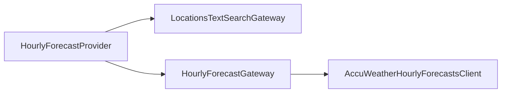

# Hourly forecast (12-hour) — phased plan

## API and alignment with existing code

- **Endpoint**: `GET /forecasts/v1/hourly/12hour/{locationKey}` with query params `language` (language tag) and `metric` (boolean), same style as `[AccuWeatherDailyForecastsClient](src/main/java/com/jonjam/weathermcp/dailyforecast/AccuWeatherDailyForecastsClient.java)`. Reference: [AccuWeather 12 hours by location key](https://developer.accuweather.com/core-weather/location-key-hourly#12-hours-by-location-key).
- **Response shape**: JSON **array** of hourly objects (not a wrapper object). Same pattern as `[AccuWeatherCurrentConditionsClient](src/main/java/com/jonjam/weathermcp/currentconditions/AccuWeatherCurrentConditionsClient.java)` returning `List<...>`.
- **New package**: `com.jonjam.weathermcp.hourlyforecast` with `[package-info.java](src/main/java/com/jonjam/weathermcp/dailyforecast/package-info.java)`-style `@NullMarked`.
- **Temperature JSON**: Hourly `Temperature` uses `Value` + `Unit` (and `UnitType` in payloads). Model with a small Lombok `@Value` + `@JsonProperty` type in `hourlyforecast` (avoid depending on `dailyforecast` for shared DTOs).
- **Domain summary**: Immutable Lombok DTOs (`@Value`, `@Builder`, private all-args constructor) per [AGENTS.md](AGENTS.md). Suggested public fields per hour: `dateTime`, `iconPhrase`, `temperatureValue`, `temperatureUnit` (maps well to tool output and docs).

## Architecture (same flow as daily)

## Phase 1 — HTTP client + AccuWeather DTOs (pause for your commit)

**Deliverables**

- `[AccuWeatherHourlyForecastsClient](src/main/java/com/jonjam/weathermcp/dailyforecast/AccuWeatherDailyForecastsClient.java)`-style interface: `@GetExchange("/forecasts/v1/hourly/12hour/{locationKey}")`, method e.g. `List<AccuWeatherHourlyForecastDto> getTwelveHoursByLocationKey(locationKey, language, metric)`.
- `AccuWeatherHourlyForecastDto` (+ nested temperature DTO) with Jackson annotations for the fields you will map in phase 2 (at minimum: `DateTime`, `IconPhrase`, `Temperature`, `Link` — add others only if needed for mapping/tests).
- Register the client in `[HttpClientConfiguration](src/main/java/com/jonjam/weathermcp/HttpClientConfiguration.java)` `@ImportHttpServices` `types` list.

---

## Phase 2 — Gateway + domain mapper + summary DTOs (pause)

**Deliverables**

- `HourlyForecastSummaryDto` and `HourlyForecastHourSummaryDto` (immutable builders).
- `HourlyForecastMapper`: `List<AccuWeatherHourlyForecastDto>` → `HourlyForecastSummaryDto` (include a stable `detailLink` for text output — e.g. first hour’s `Link` when present, or document choice in code).
- `HourlyForecastGateway`: inject client + mapper; method e.g. `Optional<HourlyForecastSummaryDto> getTwelveHourForecast(String locationKey, Locale language)` calling client with `language.toLanguageTag()` and `metric=true` (match `[DailyForecastGateway](src/main/java/com/jonjam/weathermcp/dailyforecast/DailyForecastGateway.java)`); return `Optional.empty()` when the API returns an empty list.

**Tests**

- **Unit**: `[DailyForecastMapperTest](src/test/java/com/jonjam/weathermcp/dailyforecast/DailyForecastMapperTest.java)`-style `HourlyForecastMapperTest` (nested class named after method under test).
- **Integration**: `@SpringBootTest` + `@EnableWireMock` (same as `[DailyForecastGatewayIntegrationTest](src/test/java/com/jonjam/weathermcp/dailyforecast/DailyForecastGatewayIntegrationTest.java)`), `@Autowired` the **client** only, stub `GET` path `/forecasts/v1/hourly/12hour/{key}` with `withBodyFile(...)`, assert non-empty list and parsed 

---

## Phase 3 — MCP tool (`HourlyForecastProvider`) (pause)

**Deliverables**

- Add `Prompts.HOURLY_FORECAST_PROMPT` (e.g. `"hourly-forecast"`) in `[Prompts.java](src/main/java/com/jonjam/weathermcp/Prompts.java)`.
- `HourlyForecastProvider`: copy the control flow from `[DailyForecastProvider](src/main/java/com/jonjam/weathermcp/dailyforecast/DailyForecastProvider.java)` — normalize location, `LocationsTextSearchGateway.search`, `HourlyForecastGateway.getTwelveHourForecast`, map tool result, return `CallToolResult` with text + `structuredContent`; adjust user-facing strings (“hourly” vs “daily”) and error messages.
- Private text formatter for the tool (hour lines: time, temp, condition, precip %, trailing detail link).
- `HourlyForecastToolResult` and `HourlyForecastHourToolResult` (structured MCP payload), mirroring `[DailyForecastToolResult](src/main/java/com/jonjam/weathermcp/dailyforecast/DailyForecastToolResult.java)` / `[DailyForecastDayToolResult](src/main/java/com/jonjam/weathermcp/dailyforecast/DailyForecastDayToolResult.java)`.
- `HourlyForecastToolResultMapper`: maps summary + location/country names like `[DailyForecastToolResultMapper](src/main/java/com/jonjam/weathermcp/dailyforecast/DailyForecastToolResultMapper.java)`.

**Tests**

- **Unit**: `HourlyForecastToolResultMapperTest` (Hamcrest, `@Nested` by method).
- **Unit**: `HourlyForecastProviderTest` — same scenarios as `[DailyForecastProviderTest](src/test/java/com/jonjam/weathermcp/dailyforecast/DailyForecastProviderTest.java)` (validation, no location, no forecast, success path with mocked gateway/mapper).

---

## Phase 4 — Autocomplete completion (pause)

**Deliverables**

- In `[LocationsAutocompleteProvider](src/main/java/com/jonjam/weathermcp/locations/autocomplete/LocationsAutocompleteProvider.java)`: new `@McpComplete(prompt = Prompts.HOURLY_FORECAST_PROMPT)` method delegating to existing `completeLocation(...)` (same as daily).

**Tests**

- **Unit**: New `@Nested` class in `[LocationsAutocompleteProviderTest](src/test/java/com/jonjam/weathermcp/locations/autocomplete/LocationsAutocompleteProviderTest.java)` for the new complete handler (mirror `completeLocationForDailyForecast`).

**Optional doc**: One line in `[README.md](README.md)` if it lists available tools/prompts.

---

## Conventions checklist

- `final` locals/params where not reassigned; `String.format` for dynamic strings.
- Hamcrest only in new test classes; WireMock stubs on injected `WireMockServer` instance; response bodies via `withBodyFile` under `[src/test/resources/__files/](src/test/resources/__files/)`.

