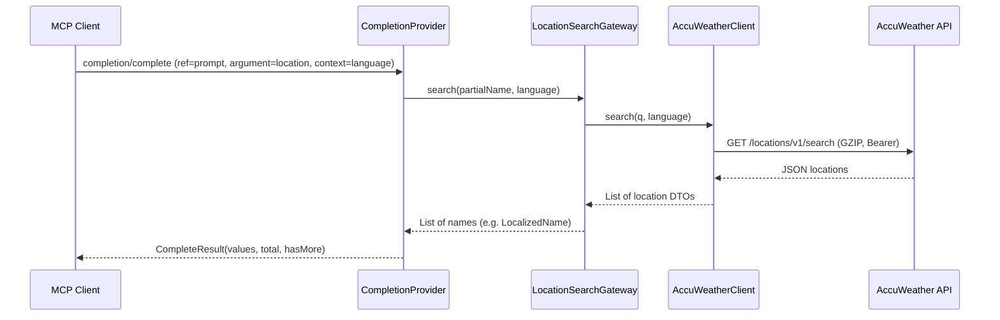

# MCP Completions for Location Autocomplete (AccuWeather)

## Goal

Implement MCP [completion](https://modelcontextprotocol.org/specification/2025-11-25/server/utilities/completion) for prompts: accept a partial city/POI name and language, call AccuWeather's location search API, and return completion values. Use a three-layer design (HTTP client interface → gateway → completion handler) and TDD, with an integration test using WireMock to stub AccuWeather.

## Architecture

## 1. Dependencies and configuration

- **Dependencies** in [build.gradle](build.gradle):
  - `spring-ai-starter-mcp-server` should provice HTTP service support
  - For integration test: Use WireMock JUnit 5 extension (in-process)
- **Configuration** in [application.yaml](src/main/resources/application.yaml) (and test profile):
  - `app.accuweather.base-url` (e.g. `https://dataservice.accuweather.com`).
  - `app.accuweather.api-key` (for `Authorization: Bearer`).
  - HTTP service client group (e.g. `spring.http.serviceclient.accuweather.base-url`) for the AccuWeather client.

## 2. AccuWeather API contract

- **Endpoint**: `GET /locations/v1/autocomplete?q={query}&language={language}` ([AccuWeather Locations API](https://developer.accuweather.com/core-weather/autocomplete#autocomplete-for-cities-and-points-of-interest)).
- **Headers**: `Authorization: Bearer {api-key}`, `Accept-Encoding: gzip` ([best practices](https://developer.accuweather.com/documentation/best-practices)).
- **Response**: JSON array of location objects; use at least `Key`, `Type`,`LocalizedName` for mapping. Completion values will be derived from `LocalizedName` (or a single display name per result).

## 3. Layer 1: Spring HTTP service interface (API client)

- **Interface**: e.g. `AccuWeatherAutocompleteClient` in a package like `com.jonjam.weathermcp.autocomplete`.
  - Method: `autocompleteForCitiesAndPointsOfInterest(String q, String language)` → returns a type that maps to the AccuWeather JSON array (e.g. `List<AccuWeatherAutocompleteDto>`).
  - Use `@HttpExchange` (or `@GetExchange`) with path `/locations/v1/autocomplete`, query params `q` and `language`.
  - Set default headers via configuration: `Accept-Encoding: gzip`, and `Authorization: Bearer ...`
- **DTO**: `AccuWeatherAutocompleteDto` with fields needed for completion (e.g. `key`, `localizedName`, `type`). Use Jackson-friendly `AccuWeatherAutocompleteDto`.
- **Configuration**: Register the client with `@ImportHttpServices` (group name e.g. `accuweather`) and set `spring.http.serviceclient.accuweather.base-url` and headers via configuration in `application.yaml`.

## 4. Layer 2: Gateway

- **Class**: e.g. `AutocompleteGateway` in `com.jonjam.weathermcp.autocomplete`
  - Method: `List<String> autocompleteForCitiesAndPointsOfInterest(String partialName, String language)`
  - Delegates to `AccuWeatherAutocompleteClient.autocompleteForCitiesAndPointsOfInterest(partialName, language)`, maps response to a list of display names (e.g. `LocalizedName`), and returns up to the limit required by MCP (e.g. 100).
  - Handle empty/null `language` (e.g. default to `"en-us"`).

## 5. Layer 3: MCP completion and prompt

- **Prompt**: Define a prompt that has a location argument (and optionally language) to ask for the current weather in a location. For example, in a class such as `CurrentConditionsProvider`:
  - `@McpPrompt(name = "current-conditions", description = "...")` with arguments e.g. `location` (required) and `language` (optional). Return a simple `GetPromptResult` (e.g. a message that includes the chosen location and language). This ties the completion to a concrete prompt as per MCP.
- **Completion**: In a dedicated component `LocationsAutocompleteProvider`:
  - `@McpComplete(prompt = "location-autocomplete")` on a method that takes `CompleteRequest.CompleteArgument argument` and optionally receives context (e.g. from a second parameter or from the argument’s context). If the argument is for "location", call the gateway with `argument.value()` and the language from `context.arguments()` (or a default); then return a `CompleteResult` with `values` (list of names), `total`, and `hasMore` (e.g. `total > values.size()`). If the argument is not "location" (e.g. "language"), return an empty list or a fixed list of language codes.

Server is as stdio in [application.yaml](src/main/resources/application.yaml)

## 6. TDD and test structure

- **Unit tests (gateway)**  
  - In `AutocompleteGatewayTest`: mock `AccuWeatherAutocompleteClient`; verify that for given client responses, `autocompleteForCitiesAndPointsOfInterest(partialName, language)` returns the expected list of names and respects default language when `language` is null/empty.
- **Unit tests (completion)**  
  - In `LocationsAutocompleteProviderTest` (or equivalent): mock `AutocompleteGatewayGatewa`; for a `CompleteArgument` with name "location" and value "san", and context with language "en-us", verify that the completion method returns a `CompleteResult` whose `values` match the gateway’s return and that `total`/`hasMore` are set as expected.
- **Integration test (Gateway → HTTP client → WireMock)**  
  - Use JUnit 5 extension with a dynamic port and set `spring.http.serviceclient.accuweather.base-url` (or equivalent) to `http://localhost:{port}` for the test context.
  - In `AutocompleteGatewayGatewayIntegrationTest`: start Spring context with the real `AccuWeatherLocationClient` and `LocationSearchGateway`, base URL pointing at WireMock. In the test, stub `GET /locations/v1/autocomplete?q=san&language=en-us` to return a JSON array matching AccuWeather’s response (e.g. a few items with `LocalizedName`). Assert that the gateway’s `search("san", "en-us")` returns the same names and that the client sends `Accept-Encoding: gzip` and `Authorization: Bearer {key}` (if WireMock can assert headers). This validates the full chain: Gateway → Spring HTTP client → WireMock (acting as AccuWeather).

## 7. Implementation order (TDD)

1. Add dependencies WireMock) and config properties.
2. **Red**: Write integration test that stubs AccuWeather and asserts on gateway result (and optionally client headers). Run and see it fail (no client/gateway yet).
3. Implement `AccuWeatherAutocompleteDto` and `AccuWeatherLocationsAutocompleteClient` (HTTP interface) with GZIP and Bearer, then `AutocompleteGateway` so the integration test passes.
4. **Red**: Write gateway unit test (mocked client); implement or adjust gateway to pass.
5. **Red**: Write completion unit test (mocked gateway); implement prompt + `@McpComplete` and pass.
6. Register the HTTP service (e.g. `@ImportHttpServices`) and ensure base URL and API key come from config. Add a test profile so integration tests use WireMock URL and a dummy API key.

## 8. Files to add or touch

| Area       | Files                                                                                                                                                      |
| ---------- | ---------------------------------------------------------------------------------------------------------------------------------------------------------- |
| Config     | [build.gradle](build.gradle) (deps), [application.yaml](src/main/resources/application.yaml) and optional `application-test.yaml` for base-url and api-key |
| API client | New: `AccuWeatherAutocompleteDto`, `AccuWeatherLocationsAutocompleteClient` (interface); config class or customizer for base URL + API key + GZIP          |
| Gateway    | New: `AutocompleteGateway`, `AutocompleteGatewayTest` (unit), `AutocompleteGatewayIntegrationTest` (WireMock)                                              |
| Completion | New: component with `@McpPrompt` + `@McpComplete`, and unit test with mocked gateway                                                                       |
| App config | `@Configuration` class: `@ImportHttpServices` for the AccuWeather client if using group-based config                                                       |

## 9. Notes

- **Capability**: MCP servers that support completions must declare the `completions` capability; declare this in confifration
- **AGENTS.md**: No dependency versions on individual dependencies; use BOM for any new libraries and avoid specifying versions in `dependencies { }` for Spring-managed artifacts.

